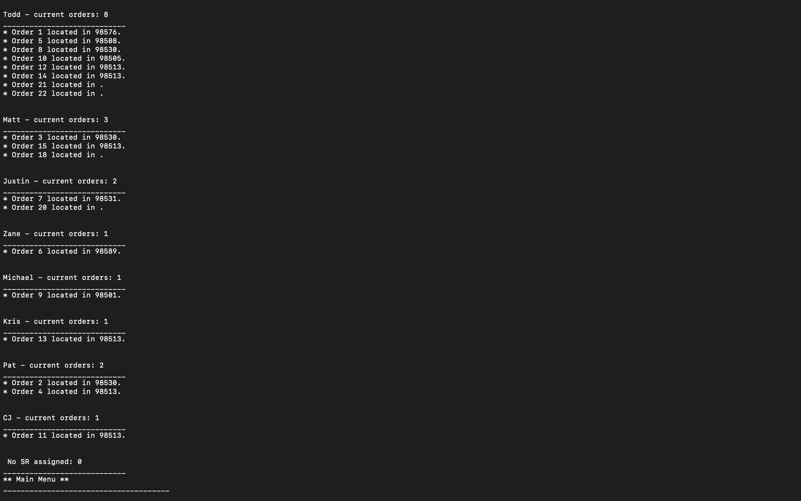

## TrackO2 - Frontend

TrackO2 is an app for tracking the delivery status of medical oxygen equipment.

##Motivation
I wanted to create an app that would assist durable medical equipment companies in facilitating the delivery of oxygen and respiratory therapy equipment to patients.

## Screenshots

Main Menu
  

Status
  

Order by driver
  

Update order
  

Delete
  

<a href="https://youtu.be/GjYF4PYAxc0">Video Demonstration</a>

## Technology Used

Ruby
SQL
ActiveRecord

## Features

Users can:
View a database of current orders
View orders by status, or by assigned driver
View individual orders with details
Create orders
Update order status, driver, or delivery instructions
Delete an order

## Installation
Clone down this project repository by clicking the green "Clone or download" button above. Copy the SSH link, and open up your computer's Terminal. Inside, type "git clone <the link you've just copied>". This should open up the project: You'll see folders labeled "bin", "config", "db", "lib", etc.

Back in your terminal, type "bundle install".

Then, from the root directory, run "rake db:migrate" to create the database locally.

Lastly, run "rake db:seed". Now you're ready to go!

## Starting the program
To start the program, type "ruby bin/run.rb". Follow on-screen instructions. For demonstration purposes, when creating a new order please use zip code "98531".

## Contributing
Contributions are welcome, submit a pull request!

## Authors
Matt Milton - <a href="https://github.com/MattMilton57">GitHub</a>

## License
This project is licensed under the [GNU GPL](https://www.gnu.org/licenses/gpl-3.0.en.html)